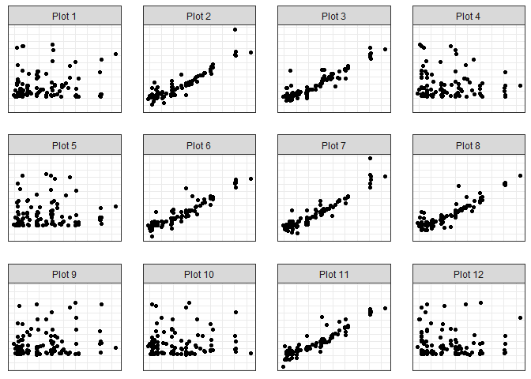

<!-- README.md is generated from README.Rmd. Please edit that file -->

# teaTasteR

<!-- badges: start -->

<!-- badges: end -->

The goal of teaTasteR is to take a dataset and create a “Lady Tasting
Tea” lineup plot for doing individual visual inference.

## Installation

And the development version from [GitHub](https://github.com/) with:

``` r
# install.packages("devtools")
devtools::install_github("kmaurer/teaTasteR")
```

## Example

In the following example we will demonstrate LTT lineups for testing for
independence between carat weight and price from the ggplot2 diamonds
data

``` r
library(teaTasteR)
## basic example code
set.seed(12345)
small_diamonds <- ggplot2::diamonds[sample(1:nrow(ggplot2::diamonds),100),]
head(small_diamonds)
#> # A tibble: 6 x 10
#>   carat cut     color clarity depth table price     x     y     z
#>   <dbl> <ord>   <ord> <ord>   <dbl> <dbl> <int> <dbl> <dbl> <dbl>
#> 1  0.4  Ideal   D     VS2      61.6    57  1050  4.77  4.71  2.92
#> 2  0.55 Ideal   G     VS1      60.9    55  1841  5.27  5.31  3.22
#> 3  0.31 Ideal   E     IF       60.4    56  1188  4.43  4.38  2.66
#> 4  0.71 Ideal   J     VS2      62.4    54  1899  5.72  5.76  3.58
#> 5  1.51 Premium G     VS1      62.4    60 12948  7.34  7.3   4.57
#> 6  1.05 Ideal   H     SI2      61.9    56  4504  6.49  6.56  4.04
```

We will feed it through the `make_lineup_dat()` function to prepare the
data for plotting

``` r
diamonds_lineup_dat <- make_lineup_dat(M=6, dat=small_diamonds,
                                       xname="carat", yname="price")
head(diamonds_lineup_dat)
#>      x permy type order
#> 1 0.40   827 null     1
#> 2 0.55  2012 null     1
#> 3 0.31   895 null     1
#> 4 0.71   646 null     1
#> 5 1.51  1031 null     1
#> 6 1.05 16900 null     1
```

Then put into lineup plot.

``` r
tt_lineup_plot(diamonds_lineup_dat)
```


